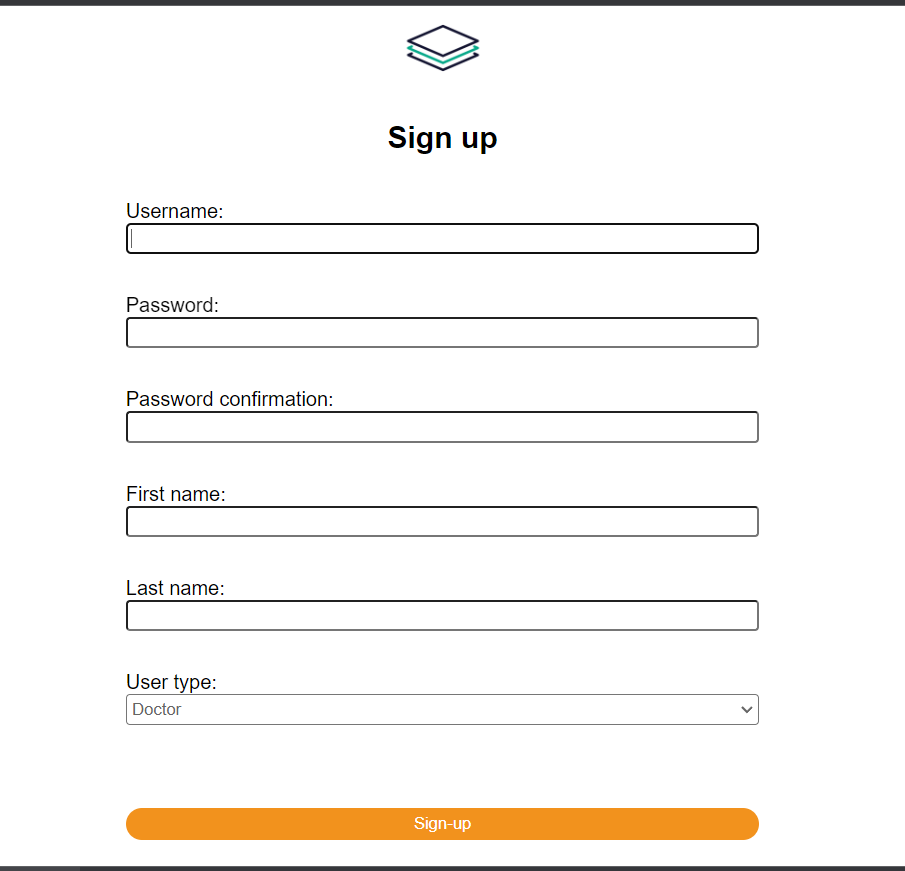

## Appointment Management system
### Installation and setup:
- Install python and pip in the system.
https://wiki.python.org/moin/BeginnersGuide/Download
- Once python is installed, make a folder, inside that create a virtual environment, for linux run:
    ```
    python3 -m venv ams
    ```
- Now run this command to activate the virtual environment
    ```
    source fast/bin/activate
    ```
- Clone this repo

- Now install the libraries mentioned in requirements.txt using pip
  ```
  pip install -r requirements.txt
  ```

### Migrations
- Now we need to run migration to create schemas in db, we are using sqlite database here.
    ```
    python manage.py migrate
    ```
Note: make sure you're running this from django project directory, where manage.py is present.

### To run the server:
- Go to repo folder and run:
    ```
    python manage.py runserver
    ```
    This will start the django development server on 8000 port. you can also use different port as well by mentioning port number next to runserver.
- Now if you visit: http://localhost:8000/
  
  Login page will show up:


    From here you can click on Signup to create new account.
 
    Here while signingup we can select the user type(Admin,Patient,Doctor) all having different write acces.

    
    After Signup Appointment creation page will open depending on user, Doctor does'nt have the option to Create an appointment. Although he can edit it.

    Next we have all appointments page where we can find all the appointments which the logged in user have, patient and doctor can only access appointment of which they are associated with.
    
    

    Here we also have the option to delete or make changes to the appointment. For past appointments there is no option for editting or deleting them.

### Architecture
- I have divided user into 3 categories, admin,patient and doctor all have different roles.

- Doctor can not create the appointments although he can edit it.
- Only week days are available for appointment with 8 timeslots.
- Admin can access all users data and can do the modification too.

- There are 4 different tables
  - UserData table is a extension of auth User table it store User type and name data
  - Patient, Doctor for storing their info. UserData foreign key
  - Appointment is the table which contains appointment details like, Date,time of appointment, reason, patient, doctor ids.


